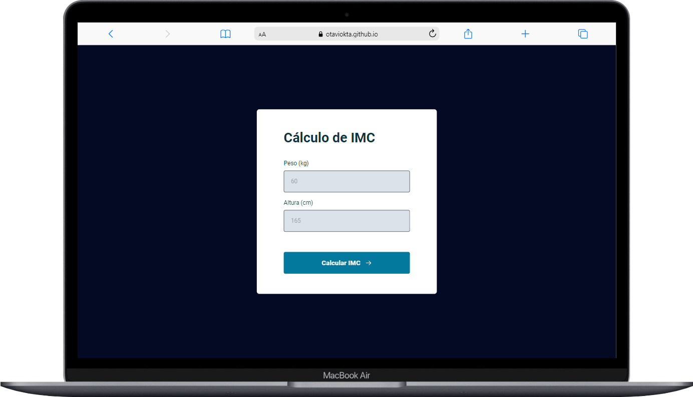
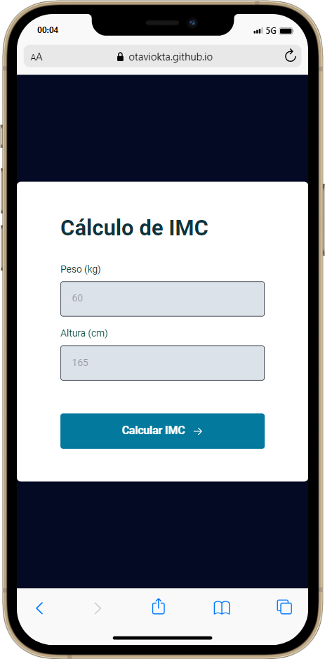

  
  

<h1 align="center">
    
</h1>

<h4 align="center">
	🚀 Completed project 🚀
</h4>

 <a href="#-About">About</a> •
 <a href="#-layout">Layout</a> •
 <a href="#-Technologies">Technologies</a> •
 <a href="#-license">License</a> •

## 🔍 About the project

Rocketseat Stage 05 IMC Calculator.

## 🎨 Layout

### 💻 desktop

  

### 📱 Mobile

  

---

## 🛠 Technologies

  
  
  

